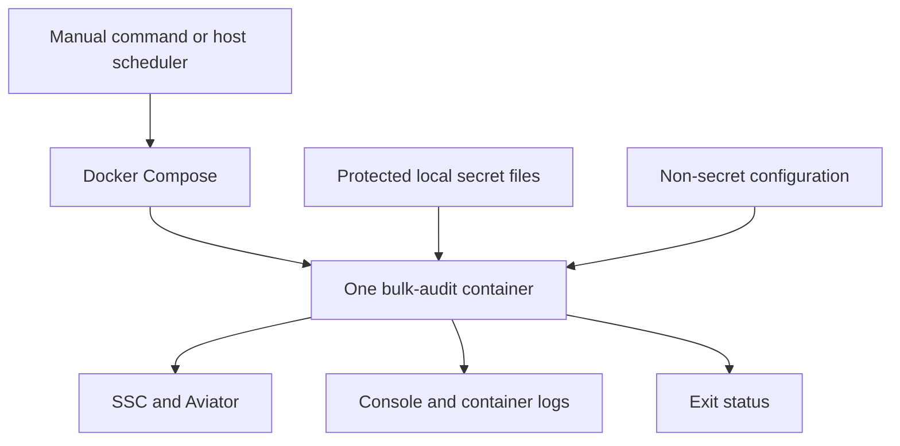
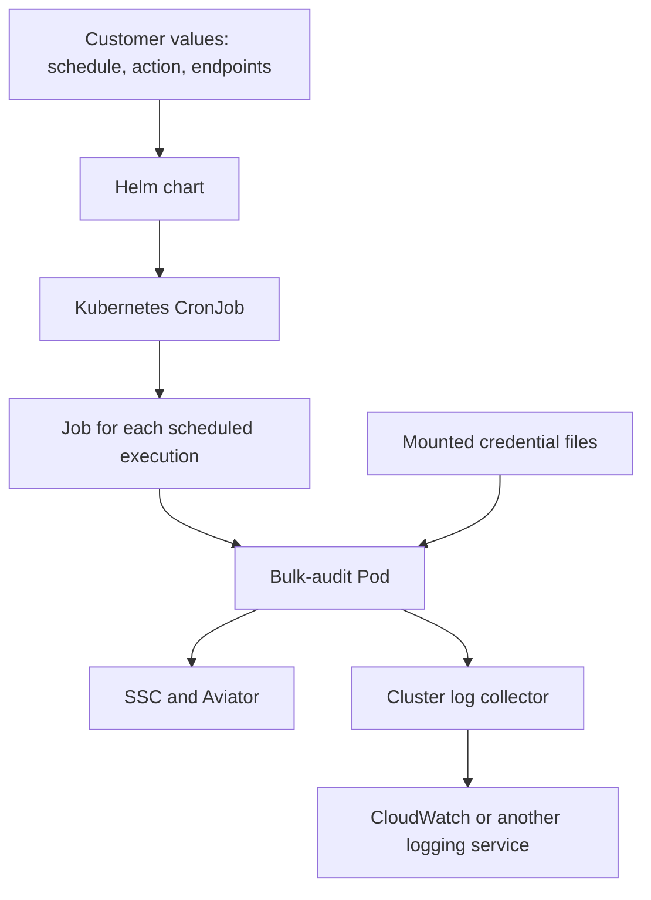

# fcli Bulk Audit: Deployment and Operations

This document describes the deployment design and production direction for scheduled fcli bulk audits. The runner, Compose files, and Helm Job/CronJob chart now have a POC implementation. See the [POC runbook](bulk-audit-poc.md) for commands, build selection, validation status, and remaining limitations. External cloud integrations and upstream fcli improvements below remain proposals.

The first milestone is execution on a local PC using Docker Compose. Production Kubernetes deployments will use a Helm chart. Both will use the same audit container, with optional cloud integrations outside the container to avoid provider lock-in.

Supported actions will be:

- `fcli ssc action run bulkaudit-sast`
- `fcli ssc action run bulkaudit-dast`
- `fcli ssc action run bulkaudit` — the deprecated SAST alias, retained for compatibility.

### Confirmed POC choices

- Start validation with manual Docker Compose execution. Include the Helm chart now; exercise Kubernetes and scheduling after the manual POC.
- Validate SAST first, then DAST, retaining `bulkaudit` as the compatibility alias.
- A test SSC/Aviator environment, the required credentials, and a small test application are available on another PC. This development PC cannot reach that environment.
- Keep POC implementation changes in this container repository. Parent fcli changes are proposals for a later phase.
- Perform local validation without live credentials, and provide a repeatable live-test procedure for the other PC. Local checks alone do not establish that a real audit succeeds.
- Document that a successful fcli process exit does not currently guarantee that all individual audits succeeded.

Use this Windows PC for offline development/validation, and a connected PC for live testing. Use the latest compatible Aviator build, allow SAST tag preparation, and preview the selected application before at most one live audit. The implementation uses mounted secret files and console/file-diagnostic streaming. Customers must supply their endpoints on the connected PC. The application filter is optional; leaving it empty considers all eligible versions within the audit limit. Cloud integrations remain outside the first milestone.

## 1. Why Docker Compose and Helm?

The **container image** packages fcli and a runner that authenticates, executes one action, and exits. It does not know the customer's endpoints, credentials, schedule, or logging destination.

Compose and Helm describe the configuration around that image for different environments.

| Component | Purpose | Typical environment |
| --- | --- | --- |
| Docker image | Packages the executable and its dependencies | Every supported deployment |
| Docker Compose | Defines how to run the container on one Docker host | Local PC or server |
| Helm chart | Packages and generates Kubernetes resources | Kubernetes cluster |
| Scheduler | Starts executions at the required times | Host scheduler or Kubernetes CronJob |

**Customers choose Compose or Helm for their environment. They do not need both.**

A plain `docker run` command could also work. Compose makes mounts, settings, security restrictions, and logging options easier to review and reuse. Kubernetes manifests could also be installed directly; Helm makes those resources configurable and provides a consistent installation and upgrade package.

Neither tool makes the audit itself more reliable automatically. Correct credential handling, exit status, cancellation, and remote-operation behavior remain responsibilities of the runner and fcli.

## 2. Docker Compose: local PC and single-server execution

Compose stores the container's runtime configuration in YAML, avoiding a lengthy command that customers must reconstruct for every execution.

The Compose configuration will define:

- Image version and selected audit action.
- SSC/Aviator endpoints and non-secret action options.
- Read-only secret-file mounts.
- Temporary storage for fcli configuration and sessions.
- Non-root execution, resource limits, and a read-only root filesystem.
- Logging configuration and shutdown grace period.

**Compose is not a cron scheduler.** Recurring execution requires a host scheduler, such as Linux cron, a systemd timer, or Windows Task Scheduler. The scheduling wrapper must preserve the container exit status and prevent overlapping runs; examples should use a host lock on Linux and a no-overlap task policy on Windows.

Docker Desktop can run the Linux container on a local Windows or macOS PC. Docker and the PC must remain running and have network access to SSC and Aviator when an execution is due. A workstation is useful for the POC; an always-on server or cluster is more appropriate for unattended production schedules.

No scheduler will be embedded inside the audit image. Each invocation performs one run and terminates.

## 3. Helm: scheduled execution on Kubernetes

Helm is a packaging and configuration tool for Kubernetes. The chart will render resources that customers can review and install using environment-specific values.

**Helm installs the configuration; Kubernetes performs the scheduling.** Kubernetes creates a Job for a scheduled execution, and the Job manages the Pod containing the audit container.

The chart will configure:

- One selected action and audit scope per CronJob.
- Schedule, timezone, suspend control, and missed-start deadline.
- References to existing secrets or an optional CSI secret provider.
- Resource requests, limits, maximum execution duration, and job-history retention.
- Non-root execution, dropped capabilities, and writable temporary volumes.
- Customer-provided truststores and service account configuration where needed.

Initial defaults should include `concurrencyPolicy: Forbid`, `restartPolicy: Never`, and `backoffLimit: 0`. Automatic whole-job retries should remain disabled until retry behavior has been validated against remote side effects.

`Forbid` prevents overlap only within the same CronJob. It does not coordinate separate installations or manual jobs. Kubernetes scheduling also does not guarantee exactly-once execution. The initial operating model is one scheduler owner per audit scope, with controlled manual execution and no distributed lock service. See the [Kubernetes CronJob documentation](https://kubernetes.io/docs/concepts/workloads/controllers/cron-jobs/).

## 4. The audit container lifecycle

Use a dedicated build target based on the existing UBI9 image, without ScanCentral Client. Keep the existing general-purpose images available for their current uses.

The runner will:

1. Validate the selected action, non-secret configuration, and required credential files without printing their contents.
2. Create isolated temporary fcli configuration and session directories.
3. Authenticate to SSC and Aviator and configure Aviator admin access.
4. Execute exactly one selected bulk-audit action.
5. Report completion, preserve the relevant failure status, and clean up temporary session data.

The runner must forward termination signals to fcli and wait for shutdown. Cleanup failures must not hide an earlier audit failure. Abrupt termination can prevent cleanup code from running, so ephemeral storage is also required.

Use an immutable image digest for production installations and record the tested fcli version. The presence of actions in the parent source tree does not prove that a particular published image contains them; verify all three actions against the selected binary before release.

## 5. Secrets and tokens

The parent fcli implementation requires three separate credentials:

| Credential | Purpose |
| --- | --- |
| SSC token | Access SSC applications, results, and audit data |
| Aviator user token | Execute audits |
| Aviator admin private key | List and create Aviator applications required by the actions |

Use dedicated automation identities with the minimum permissions needed by the actual action. The current actions require admin operations for Aviator application management; that requirement cannot be removed by container configuration alone.

### Secret delivery options

| Option | Advantages | Disadvantages | Suggested use |
| --- | --- | --- | --- |
| Local files through Compose secrets | Simple; no cloud dependency | Customer manages host storage, permissions, and rotation | Local POC and smaller installations |
| Existing Kubernetes Secret mounted as files | Portable; easy integration | Requires appropriate RBAC, encryption at rest, and rotation procedures | Baseline Helm support |
| External Secrets Operator | Integrates external providers and synchronizes credentials | Additional operator; copies values into Kubernetes Secrets | General production recommendation |
| Secrets Store CSI driver | Can mount external credentials without copying values into Kubernetes Secrets | Provider-specific setup and operational prerequisites | Customers already using CSI |
| Cloud SDK in the audit container | Direct retrieval from a provider | Couples the image to SDKs, provider APIs, and identity configuration | Avoid in the initial design |

**Recommendation: use mounted files as the container's stable interface.** Start with local files, support existing Kubernetes Secrets, and provide optional external-provider examples. Customers can change providers without changing the audit image.

[External Secrets Operator](https://external-secrets.io/latest/introduction/overview/) synchronizes external values into Kubernetes Secrets. AWS also supports mounting Secrets Manager values through ASCP and the Secrets Store CSI driver; see the [AWS EKS documentation](https://docs.aws.amazon.com/en_en/eks/latest/userguide/manage-secrets.html).

### Credential handling rules

- Do not commit secret values in Compose files, Helm values, `.env` files, or image layers. Helm values should reference secrets, not contain them.
- Do not place credential values in command arguments or echo commands containing credentials. Disable shell tracing and avoid verbose authentication diagnostics.
- Aviator already supports file-based token and private-key inputs. Use those inputs directly.
- SSC currently accepts a token value. The container-only approach will read its mounted file into a narrowly scoped environment variable for the login process. This avoids storing the value in container configuration, but it remains accessible to sufficiently privileged process inspection.
- Store fcli session and configuration data on memory-backed temporary storage with restrictive permissions. Do not share a persistent session directory between runs. fcli's built-in session encryption is not the primary security boundary.
- Use workload identity for cloud secret retrieval. It replaces static cloud access keys, not SSC or Aviator credentials.
- Keep TLS verification enabled and support customer-provided CA/truststore configuration.

Compose secrets are not a complete secret-management service: customers still protect and rotate the source files. For file-backed Compose secrets, do not rely on `uid`, `gid`, or `mode` remapping; validate actual host-file readability by the non-root container user. See the [Docker Compose service reference](https://docs.docker.com/reference/compose-file/services/#secrets).

### Rotation and expiry

Each execution should read current credential files and establish fresh local sessions. A running audit may continue using the credential it loaded at startup; updating a mounted file does not guarantee that fcli reloads it mid-run.

Updating a secret store also does not itself renew an SSC or Aviator credential. Customer runbooks must cover credential issuance, expiry monitoring, replacement, and revocation. Credentials must remain valid for the expected execution duration, and authentication failures must produce a visible failed run.

## 6. Logs and operational visibility

The container writes execution output to stdout/stderr. Platform components forward those logs, keeping cloud-specific logging dependencies outside the audit image.

| Deployment | Logging approach |
| --- | --- |
| Local PC | Console and bounded local log retention |
| Docker server | Host collector or an optional Docker logging driver |
| Kubernetes | Existing cluster log collector |
| AWS example | Fluent Bit or Docker `awslogs` forwarding to CloudWatch |

For Docker `awslogs`, AWS credentials belong to the Docker daemon's execution environment, preferably an EC2 instance role. Supplying AWS credentials only to the audit container does not configure the daemon's logging driver. Use a separate stream per execution/container and provision log-group retention and access controls. See the [Docker CloudWatch driver documentation](https://docs.docker.com/engine/logging/drivers/awslogs/).

For Kubernetes, provide an example using the customer's existing collector rather than installing a cluster-wide logging stack with the application chart. AWS documents [Fluent Bit forwarding to CloudWatch](https://docs.aws.amazon.com/AmazonCloudWatch/latest/monitoring/Container-Insights-setup-logs-FluentBit.html).

Runner events should contain a run identifier, action, phase, duration, and exit status. Preserve fcli diagnostics without claiming that all existing fcli output is structured JSON. Avoid logging authentication output, request bodies, or sensitive audit payloads; verify this with sentinel credentials in automated tests.

Monitoring should detect failed runs, missed executions, timeouts, authentication problems, and quota exhaustion. Log delivery needs separate monitoring: a successful audit does not prove that CloudWatch received its logs. Configure collector buffering, retention, and outage behavior explicitly for each deployment.

For local scheduled runs, retain output before removing completed containers; otherwise their Docker-managed logs may disappear with them.

## 7. Container-only POC versus focused fcli changes

Inspection of the parent source revealed that both bulk actions can continue after individual failures without returning a failing overall exit code. A scheduler can therefore report success even when individual audits failed.

| | Option 1: focused fcli changes | Option 2: container repository only |
| --- | --- | --- |
| Failure reporting | Add opt-in strict completion status and a machine-readable summary | Preserve existing exit codes; some individual failures remain visible only in logs |
| SSC credentials | Add a mutually exclusive token-file input | Read a mounted token into the login process environment |
| Release impact | Requires a coordinated fcli release and compatibility tests | Faster initial delivery |
| Appropriate milestone | Production destination | Local POC |

For Option 1, strict mode should finish processing candidates, then return nonzero for actual selection, application-creation, or audit failures, including partial audits. Intentional skips and quota outcomes should be reported separately. Existing behavior can remain compatible through opt-in flags. Preparation failures and their effect on completion status must also be covered by the result contract.

Do not parse human-readable log wording to manufacture reliable completion status under Option 2. That would create a fragile dependency on message formatting.

**Recommendation: use Option 2 for the local POC, then adopt Option 1 before production rollout. Upstream changes remain outside the agreed POC scope.**

The POC decision is now Option 2. The following upstream improvements remain proposals; no new fcli commands or options described here should be assumed to exist.

### Proposed fcli improvements for container usability

| Priority | Improvement | Benefit to container users |
| --- | --- | --- |
| First | Opt-in strict completion status covering nested failures and partial audits | Schedulers and scripts can distinguish process completion from successful auditing without interpreting log text |
| First | A versioned JSON summary with selected, attempted, succeeded, failed, and skipped counts and explicit skip reasons | One clear result for users, monitoring, and test automation; keep diagnostic logs separate from machine-readable output |
| First | Native SSC token-file input, mutually exclusive with a direct token | Consistent file-based authentication alongside Aviator; removes the runner's need to put the SSC token in a login-process environment variable |
| Next | A non-mutating preflight operation | Check required action availability, configuration, connectivity, TLS trust, authentication, and testable permissions before attempting audits; report checks that cannot be verified without mutation |
| Next | Explicit application-version targeting and a preview of the selected scope | Make a one-application trial easier and safer than relying on a broad filter and an audit-count limit |
| Next | Clear credential-expiry diagnostics and non-interactive failure behavior | Explain which credential needs replacement and prevent unattended execution from waiting for input |
| Later | Consistent line-oriented or structured progress and documented cancellation behavior | Improve log readability and distinguish completed, interrupted, and uncertain remote operations |

Preserve existing CLI compatibility when adding these capabilities. Continue using the existing fcli directory overrides for temporary sessions; a new session-isolation mechanism is not required for this POC. None of these improvements should claim exactly-once remote execution or silently retry audits that may already have changed SSC.

The actions are currently labelled `PREVIEW` in the inspected parent source. Production deployment packaging does not change their product support status.

## 8. Delivery stages and acceptance checks

### Stage 1: local POC

Deliver the dedicated runner image, base Compose configuration, non-secret examples, secret-file setup instructions, and manual execution instructions. Exercise all three actions against a compatible fcli binary.

Validate configuration first, then run an action dry run against a test environment, followed by a restricted live scope. A dry run still requires credentials and may query remote services. For SAST, require an explicit tag-mapping strategy rather than silently enabling remote tag preparation.

### Stage 2: scheduling and Kubernetes

Add host scheduler examples and the Helm chart. Validate non-overlap, resource limits, deadlines, cancellation, job status, and log retention. Add a local Kubernetes smoke test where practical.

### Stage 3: production integrations

Add optional AWS secret-provider and CloudWatch examples, while preserving the provider-neutral base deployment. Document equivalent integration points for other clouds without claiming untested integrations are supported.

Resolve the fcli failure-status contract, pin a tested image digest, and publish a compatibility matrix before a production release. Include image vulnerability scanning and software bill-of-materials generation in release validation.

### Required acceptance scenarios

- Successful run and a run with no eligible applications.
- Missing, unreadable, invalid, and expired credentials.
- Application-selection, creation, preparation, and partial-audit failures.
- Credential sentinel values absent from logs and process arguments.
- Non-root execution with a read-only root filesystem and accessible secret mounts.
- Cancellation and timeout with correct failure status and temporary-state cleanup.
- No automatic whole-job retry after a partially completed remote operation.
- Repeated schedule triggers and controlled manual execution without overlap.
- Credentials rotated between executions.
- Log delivery, retention, and collector outage behavior.
- Helm rendering/schema validation and Compose configuration validation without secret values.

The end goal is one tested audit image that moves from a local PC to Kubernetes by changing its scheduling, secret delivery, and logging configuration.
