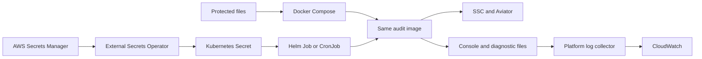

# Fortify Bulk Audit: Proof of Concept Guide

**Start with a Docker Compose dry run. Review the selected application before one live audit.**

| Item | Value |
| --- | --- |
| Status | Proof of concept (POC): a limited implementation for testing the design |
| Guide date | 2026-10-08 |
| fcli release | `v3.28.0` |
| Local image | `fcli-bulk-audit:3.28.0-poc.3` |
| Helm chart | `0.2.1` |
| Platform | Linux containers on Intel or AMD 64-bit processors |

This POC does not establish production support for the fcli actions.

## 1. Purpose and design

fcli is the Fortify command-line tool.
Software Security Center (SSC) stores application versions and security results.
Aviator provides the audit service.
The runner creates temporary login sessions, executes one action, and removes temporary data.
You do not need existing fcli sessions on the host computer.

| Component | Purpose |
| --- | --- |
| Image | Packages fcli and the runner. A container is an instance of that image. |
| Docker Compose | Starts the container with settings, credential files, storage, and resource limits on one computer. |
| Kubernetes | Manages containers in a cluster of computers. A Pod contains the audit container. |
| Helm chart | Supplies templates and settings for a Kubernetes installation. A named installation is a Helm release. |
| Job | Starts work that finishes. The default chart creates one Job. |
| CronJob | Creates Jobs on a schedule. The chart starts with scheduling disabled. |

Choose Docker Compose or Helm for the deployment environment.
Docker Compose does not supply a scheduler.
Helm does not build an image or create a cluster.



External Secrets Operator copies external credentials into Kubernetes Secrets.
CloudWatch is an AWS log and monitoring service.
The platform manages cloud access; the audit image contains no AWS client or AWS credentials.

| Action | Use |
| --- | --- |
| `bulkaudit-sast` | Audit static application security testing (SAST) results. Start here. |
| `bulkaudit-dast` | Audit dynamic application security testing (DAST) results. Use eligible WebInspect results. |
| `bulkaudit` | Use the older SAST action name. The selected fcli release marks this alias as deprecated. |

A **dry run** connects to the servers and previews proposed work without performing the audit.
A **live audit** can create Aviator applications, prepare SSC tags, consume quota, and change SSC audit results.
The default limit is one application-version audit, which can include many issues.
An empty filter considers all eligible versions within that limit.
Use a filter to select the intended test application.

## 2. Implementation and changes

| File | Responsibility |
| --- | --- |
| [Runner](../linux/bulk-audit.sh) | Validate settings, prepare credentials, run fcli, report status, and remove temporary sessions. |
| [Dockerfile](../linux/Dockerfile) | Build the `fcli-bulk-audit` target with checksum and signature verification. |
| [Build defaults](../deploy/compose/.env.example) | Define the fcli version, checksum, image name, and initial customer settings. |
| [Docker Compose](../deploy/compose/compose.yaml) | Configure manual execution and credential file sources. |
| [Helm chart](../charts/fcli-bulk-audit/values.yaml) | Configure the Job or CronJob. Derive the Job deadline from the audit timeout. |
| [AWS secret example](../deploy/kubernetes/external-secrets-aws.yaml) | Map an AWS secret into the three required Kubernetes Secret keys. |
| [CloudWatch override](../deploy/compose/compose.cloudwatch.yaml) | Send Docker console output through the Docker daemon's AWS identity. |
| [Diagnostic collector example](../deploy/logging/fluent-bit-cloudwatch.conf) | Send diagnostic files through a separate Fluent Bit collector. |
| [Tests](../tests) | Check execution behavior and rendered deployment configuration without live credentials. |

For an existing installation:

1. Preserve the local `.env`, credential files, and Helm values.
2. Copy the three build settings from `.env.example` into the existing `.env`.
3. Update the Helm image tag to match the new image.
4. Remove `job.activeDeadlineSeconds` from existing Helm values.
5. Rebuild the image and repeat a dry run.

The chart now calculates the deadline as `audit.timeoutSeconds + job.terminationGracePeriodSeconds + 15` seconds.
The defaults produce a 3660-second Job deadline.
Use a new image tag after further code changes.
For releases, prefer an image digest, which identifies exact image content.
The audit image uses UBI 9 minimal with a pinned base digest in `linux/Dockerfile`.
Update that digest, rebuild, and scan the image when Red Hat publishes security fixes.

## 3. Docker Compose test

The examples use PowerShell.
Run each command separately and check the result.
The repository root contains `README.md`, `linux`, `deploy`, and `charts`.

### Prepare settings and credentials

The test computer needs a running Linux Docker engine and Docker Compose version 2 or later.
The CloudWatch override requires Docker Compose 2.24.4 or later.
The container needs network access to SSC and Aviator.
Allow enough memory for the 4 GiB container limit and the Docker engine.

1. Check the Docker engine:

```powershell
docker version
docker compose version
```

`docker version` must show both Client and Server information.

2. From the repository root, prepare a new configuration:

```powershell
cd deploy/compose
Copy-Item .env.example .env
New-Item -ItemType Directory -Force secrets, logs
```

Do not overwrite an existing configured `.env` file.

3. Edit `.env` with the SSC address, Aviator address, tenant, and intended application filter.
4. Keep `BULK_AUDIT_DRY_RUN=true`, `BULK_AUDIT_MAX_AUDITS=1`, and `SSC_INSECURE=false`.
5. Create these files with an editor or a credential management tool:

| File | Content |
| --- | --- |
| `secrets/ssc-token` | SSC token |
| `secrets/aviator-token` | Aviator user token |
| `secrets/aviator-private-key` | Complete PEM private key for Aviator admin access |

PEM is a text format for cryptographic material.
Preserve the private key's header, footer, and line breaks.
Use UTF-8 text without a byte-order mark or surrounding token quotes.
The runner removes trailing token line endings and rejects whitespace inside scalar tokens.
Keep the original credential files outside Git and image layers.
Limit access with host file permissions.
The container uses user and group identifier `10001`.

### Build and preview

1. From `deploy/compose`, check the configuration and build the image:

```powershell
docker compose config --quiet
docker compose build --pull bulk-audit
docker compose run --rm bulk-audit --check-image
```

The build downloads fcli and verifies the checksum and publisher signature.
The image check must report `image_compatible` and exit code `0`.
The image check does not test credentials.
Docker Compose still needs the credential files because Docker mounts them before startup.

2. Check file access without printing credentials:

```powershell
docker compose run --rm --entrypoint /bin/bash bulk-audit -c 'for f in /run/secrets/*; do test -r "$f" && test -s "$f" || exit 1; done'
$LASTEXITCODE
```

3. Start the dry run:

```powershell
docker compose up --abort-on-container-exit --exit-code-from bulk-audit --force-recreate bulk-audit
$auditExitCode = $LASTEXITCODE
Write-Output "Container exit code: $auditExitCode"
docker compose logs --no-color bulk-audit | Out-File -Encoding utf8 logs/dry-run.log
```

Record the exit code immediately because later commands can change `$LASTEXITCODE`.
Save logs before another run replaces the container.

**Dry-run acceptance:**

- SSC login, Aviator login, and Aviator admin configuration succeed.
- The output reports `dry_run=true`.
- The preview selects the intended application version.
- The output reports no operation failure.

No eligible versions can be a valid result.
That result does not prove that the selected application has data suitable for an audit.

### Perform one live audit

1. Review the dry-run result.
2. Set `BULK_AUDIT_DRY_RUN=false` in `.env`.
3. Keep the reviewed filter and `BULK_AUDIT_MAX_AUDITS=1`.
4. Repeat the execution command and save the logs as `logs/live-sast.log`.
5. Confirm the expected audit results in SSC and the action output.
6. Restore `BULK_AUDIT_DRY_RUN=true`.

**Exit code `0` does not prove that every audit operation succeeded.**
The current bulk actions can continue after individual failures.
The runner preserves fcli exit codes and does not retry the audit automatically.

For DAST, select `BULK_AUDIT_ACTION=bulkaudit-dast` and suitable WebInspect data.
Repeat the preview before a live DAST audit.
Test `bulkaudit` separately as the SAST alias.

## 4. Helm test and scheduling

Use a vendor-supported Kubernetes release with Kubernetes 1.27 APIs or later.
Use Helm 3 or 4 and the `kubectl` command for cluster access.
The cluster must have the new image in its local image store or a registry.
A registry stores downloadable images.
For Rancher Desktop local tests, verify that Kubernetes can access the Docker engine's image store.

1. From the repository root, confirm the test cluster:

```powershell
kubectl config current-context
```

2. Create the test namespace and local values file if these resources do not already exist:

```powershell
kubectl create namespace fcli-audit
Copy-Item charts/fcli-bulk-audit/values.yaml charts/fcli-bulk-audit/values.local.yaml
```

3. Supply credentials through either local files below or the external secret procedure in section 5.

```powershell
kubectl -n fcli-audit create secret generic fcli-bulk-audit-credentials --from-file=ssc-token=deploy/compose/secrets/ssc-token --from-file=aviator-token=deploy/compose/secrets/aviator-token --from-file=aviator-private-key=deploy/compose/secrets/aviator-private-key
```

Use one owner for the credential Secret.
Do not combine manual Secret management with External Secrets management for the same Secret.

4. Edit the image reference and `audit` connection settings in `values.local.yaml`.
5. Keep `audit.dryRun: true`, `audit.maxAudits: 1`, and `schedule.enabled: false`.
6. Set `image.pullPolicy: Never` only when the test cluster already has the local image.
7. Check and install the chart:

```powershell
helm lint charts/fcli-bulk-audit -f charts/fcli-bulk-audit/values.local.yaml
helm template poc charts/fcli-bulk-audit -f charts/fcli-bulk-audit/values.local.yaml
helm install poc charts/fcli-bulk-audit -n fcli-audit -f charts/fcli-bulk-audit/values.local.yaml
kubectl -n fcli-audit get jobs,pods
kubectl -n fcli-audit logs -f job/poc-bulk-audit
```

Review the same dry-run acceptance checks from section 3.
Helm installation success does not prove audit success.
Save the output before cleanup; the chart removes completed Jobs after 24 hours by default.

To change a completed Job's settings:

1. Confirm that the Job has finished and save its logs.
2. Run `helm uninstall poc -n fcli-audit`.
3. Edit the local values, including `audit.dryRun: false` for a reviewed live test.
4. Repeat the installation and result checks.
5. Restore `audit.dryRun: true` after the test.

Kubernetes does not allow changes to an existing Job's Pod template.
Removing the release does not remove the separately managed credential Secret.

After manual tests pass, replace the completed Job installation with a suspended CronJob:

```yaml
schedule:
  enabled: true
  cron: "0 2 * * *"
  timeZone: Etc/UTC
  suspend: true
```

This schedule means 02:00 each day in Coordinated Universal Time (UTC).
Review the values before a Helm upgrade sets `schedule.suspend: false`.
The `Forbid` policy prevents normal overlap within this CronJob.
Assign one scheduler to each audit scope; separate installations do not coordinate their runs.

## 5. Secret injection and renewal

The container interface consists of three files under `/run/secrets/`.
The chart reads the existing Secret named by `existingSecret`.
This interface supports external providers without changes to the audit image.

| Method | Benefit | Responsibility |
| --- | --- | --- |
| Docker Compose files | No cloud dependency. | The host owner protects and refreshes the files. |
| Existing Kubernetes Secret | Uses standard Kubernetes mounts. | The cluster owner controls access, storage encryption, and updates. |
| External Secrets Operator | Synchronizes external credentials into the same Secret interface. | The platform owner operates the controller and its cloud identity. |

For Docker Compose, a host credential agent can supply files through these optional settings:

```dotenv
SSC_TOKEN_SOURCE=/secure/fcli/ssc-token
AVIATOR_TOKEN_SOURCE=/secure/fcli/aviator-token
AVIATOR_PRIVATE_KEY_SOURCE=/secure/fcli/aviator-private-key
```

These values are host paths, not credential values.
The files must exist and allow the container user to read them.
Each new invocation reads current files and creates new sessions.
Updating a provider does not renew expired SSC or Aviator credentials automatically.
The credential owner handles issuance, expiry, replacement, and revocation.

### AWS Secrets Manager example

1. Install External Secrets Operator with support for `external-secrets.io/v1` resources.
2. Give the controller an AWS workload role limited to the required secret.
3. Store one JSON secret with properties `sscToken`, `aviatorToken`, and `aviatorPrivateKey`.
4. Preserve the private key's line breaks in the decoded property value.
5. Edit the region and remote secret name in [the example](../deploy/kubernetes/external-secrets-aws.yaml).
6. Apply the example in the audit namespace:

```powershell
kubectl -n fcli-audit apply -f deploy/kubernetes/external-secrets-aws.yaml
kubectl -n fcli-audit wait --for=condition=Ready externalsecret/bulk-audit --timeout=120s
```

7. Confirm `existingSecret: fcli-bulk-audit-credentials` before installing the chart.
8. Replace a test credential in AWS and confirm synchronization before a new dry run.

The example uses the controller's AWS identity and refreshes the Kubernetes Secret every hour.
The audit Pod does not need AWS permissions or a Kubernetes API token.
Grant only the required secret-read permissions; encrypted secrets can also require access to their encryption key.
The operator copies credential values into Kubernetes storage, so configure access controls and encryption there.
See the [provider documentation](https://external-secrets.io/latest/provider/aws-secrets-manager/) and [AWS identity setup](https://external-secrets.io/latest/provider/aws-access/).

## 6. Logs and CloudWatch integration

The runner emits JSON lifecycle events to standard error.
JSON is a structured text format.
Events include `schema_version`, `run_id`, `phase`, `elapsed_seconds`, and a numeric or null `exit_code`.
For audit executions, `run_id` matches the diagnostic directory name, including its random suffix.
Direct fcli output remains visible as plain text.
Collectors must accept both formats.

Each run also creates `/logs/<run-directory>/` with separate diagnostic files:

- `ssc_login.log`
- `aviator_login.log`
- `aviator_admin.log`
- `audit.log`

Files appear as their phases start.
The runner uses fcli's `high` masking setting.
Review logs before sharing sensitive application data.
The `finished` event reports the inner runner status; the outer timeout command can return `124` separately.

| Log destination | Lifetime and owner |
| --- | --- |
| Docker console logs | Docker rotates three files of 10 MB per container. Save output before container removal. |
| Docker diagnostic volume | Files survive container replacement. The host owner must archive and remove old runs. |
| Default Helm diagnostic storage | Kubernetes removes files with the Pod. Export files before Pod removal. |
| Existing persistent volume claim | A claim requests persistent Kubernetes storage. The storage owner manages capacity and file retention. |
| CloudWatch log group | The cloud owner sets retention and checks delivery. |

From `deploy/compose`, copy diagnostics before cleanup:

```powershell
New-Item -ItemType Directory -Force logs/fcli
docker compose cp bulk-audit:/logs/. logs/fcli/
```

Delete diagnostic files only after each run finishes and you confirm log collection or export.

### Docker console output to CloudWatch

1. Create a CloudWatch log group with the required retention period.
2. Give the Docker daemon permission to create streams and write events in that group.
3. Prefer the host's AWS instance role over static AWS keys.
4. Set the non-secret destination values and run from `deploy/compose`:

```powershell
$env:AWS_REGION = 'us-east-1'
$env:CLOUDWATCH_LOG_GROUP = '/fortify/bulk-audit'
docker compose -f compose.yaml -f compose.cloudwatch.yaml config --quiet
docker compose -f compose.yaml -f compose.cloudwatch.yaml up --abort-on-container-exit --exit-code-from bulk-audit --force-recreate bulk-audit
```

The override replaces local driver options and uses each container identifier as its stream name.
AWS credentials belong to the Docker daemon, not the audit container.
This route sends console output; diagnostic files need a collector.
See the [Docker CloudWatch driver](https://docs.docker.com/engine/logging/drivers/awslogs/).

### Kubernetes and diagnostic files

Use the cluster's existing collector for standard output and standard error.
For retained diagnostics, set `storage.existingLogClaim` to a suitable existing claim.
Mount that claim read-only at `/logs` in a separate collector with user identifier `10001`.
The claim's access mode must allow both the audit Pod and the collector to mount the storage.

The [Fluent Bit example](../deploy/logging/fluent-bit-cloudwatch.conf) reads `/logs/*/*.log` and includes each source path.
Fluent Bit is a log collection tool.
Give the collector its own AWS identity, destination variables, and writable persistent storage at `/var/lib/fluent-bit`.
The example stores read offsets and buffered records there.
The output buffer limit is 128 MB; monitor delivery failures and storage use.
Full buffers can cause lost records.
See [Fluent Bit's CloudWatch output](https://docs.fluentbit.io/manual/data-pipeline/outputs/cloudwatch).

## 7. Troubleshooting and limits

| Symptom | Action |
| --- | --- |
| Docker shows no Server information | Start the Docker engine before building. |
| Image checksum failure | Review the selected release. Update the version and checksum together after verification. |
| Missing or unreadable credential file | Check the path, encoding, host permissions, and container access. |
| `ssc_login` failure | Check the SSC address, token, permissions, network access, and certificate trust. |
| `aviator_login` or `aviator_admin` failure | Check the user token, tenant, private key, and Aviator connectivity. |
| No eligible versions | Check the filter and the application's available results. |
| `ImagePullBackOff` | Check the registry reference, image availability, and registry credentials. |
| Exit `64` | Correct runner configuration or credential files. |
| Exit `69` | Select a compatible fcli build. |
| Exit `74` | Check diagnostic storage permissions and capacity. |
| Exit `124`, `130`, `143`, or `137` | Check timeout, interruption, or memory limits. Inspect SSC before another live run. |

For private certificates, use [the truststore override](../deploy/compose/compose.truststore.yaml).
A truststore contains certificates that the client trusts.
Supply `certs/truststore.jks` and `secrets/truststore-password` with suitable file permissions.
Include `-f compose.truststore.yaml` for every Docker Compose command that starts a container.
For Helm, configure `truststore.existingSecret` with the certificate and password keys in `values.yaml`.

Keep `SSC_INSECURE=false` for normal use.
Explicit test troubleshooting can set `SSC_INSECURE=true` or `audit.sscInsecure: true` to disable SSC certificate verification.
Restore verification after that test.
This option does not change Aviator certificate checks.

The default runner timeout is 3600 seconds, with a 30-second forced-stop allowance.
The container limits memory to 4 GiB and CPU capacity to 2 processors.
Session storage uses 64 MiB; temporary storage uses 1 GiB.
GiB and MiB are binary storage units.
Temporary files use container memory, so larger result files can need higher limits.

## 8. Validation and remaining work

From the repository root, run:

```powershell
python -m pip install -r tests/requirements.txt
python -m unittest discover -s tests -v
helm lint charts/fcli-bulk-audit
```

Runner tests need Python 3, Bash, and GNU coreutils.
On Windows, the tests use Git Bash.
Deployment tests need Helm and Docker Compose; read skip messages when tools are missing.
With a running Docker engine, run `bash tests/smoke-images.sh` from Git Bash or Linux Bash.
Use `bash tests/smoke-images.sh --windows-checkout` to check Windows line endings and file permissions.

All 20 runner tests passed in a Linux container, including the signal test.
All 12 deployment tests passed.
Helm lint and ShellCheck passed.
All three images passed build and container checks for normal and Windows checkout formats.
The AWS examples need live validation with customer infrastructure.
This revision still needs a live SSC and Aviator test.

Record the image identifier, fcli version, action, application version, run identifier, exit code, and SSC result for each live test.
Check credential renewal, cancellation, log delivery, and schedules before unattended use.

The remaining fcli improvements are:

- Return a failing status for partial audit failures.
- Produce a structured summary of successful, failed, and skipped operations.
- Accept an SSC token file directly.
- Normalize Aviator token line endings within fcli.

These changes would remove container workarounds and improve scheduler results.
The POC keeps cloud identity, credential renewal, log retention, and scheduling outside the audit image.

### Security audit: 2026-10-08

The audit covered the POC branch changes, deployment templates, credential handling, CI, and the built Linux audit image.
The reviewed branch started at commit `20f5b2d`.
Gitleaks 8.30.1 found no secrets in the 19 POC commits reviewed before these fixes.
Trivy 0.75.0 found no secrets in the tracked source snapshot or the audit image.
Secret scans do not prove that every possible credential format is absent.

| Change | Reason |
| --- | --- |
| Replace the UBI 9.7 standard runtime with pinned UBI 9.8 minimal | Remove unused packages and apply available base-image fixes. |
| Remove privileged executable permissions | The audit process does not need tools that change user or group identity. |
| Pass the tenant as `--tenant=value` | Prevent fcli from treating tenant values as argument files or command options. |
| Disable process core dumps | Crash dumps can contain credentials from process memory. |
| Include the log directory suffix in `run_id` | Containers can start during the same second with the same process identifier. |
| Disable stored CI checkout credentials | The build and tests do not need repository credentials after checkout. |
| Pin the test dependency and scanner images | Dependency updates require a reviewed version change. |

An offline test confirmed that fcli 3.28.0 expands a separate tenant argument starting with `@`.
The updated runner passes that value literally, and a regression test checks the argument form.

Trivy reported these installed-package findings:

| Severity | Previous audit image | Updated audit image |
| --- | --- | --- |
| Critical | 0 | 0 |
| High | 72 | 13 |
| Medium | 353 | 116 |
| Low | 297 | 75 |

The 13 remaining high findings cover seven distinct CVEs across OpenSSL, PCRE2, and util-linux packages.
The scan lists no fixed package versions for those findings.

| Package family | Open CVEs |
| --- | --- |
| util-linux | `CVE-2026-53613` |
| OpenSSL | `CVE-2026-54876`, `CVE-2026-75804`, `CVE-2026-84782` |
| PCRE2 | `CVE-2026-103111`, `CVE-2026-86145`, `CVE-2026-89161` |

The scanner marks `CVE-2026-86145` as `will_not_fix`.
These findings remain open; container restrictions do not prove that the affected code is unreachable.
The generic `fcli-ubi9` image still uses its original base and needs separate remediation.

CI scans source files for secrets and known dependency vulnerabilities.
CI reports all high and critical audit-image findings.
CI fails on critical findings and high findings with available fixes.
A passing CI result does not close unfixed findings or approve production use.
For a local scan with Trivy installed, run:

```powershell
trivy image --scanners vuln,secret --severity HIGH,CRITICAL fcli-bulk-audit:3.28.0-poc.3
```

Review each scan against the exact image digest and current vulnerability database.
The image scan does not establish full dependency coverage inside the native fcli executable.
Obtain an fcli software bill of materials (SBOM), which lists build dependencies, for that review.

The configuration scan also reported default namespace, health-check, archive-copy, and Windows path warnings.
Use the dedicated namespace from section 4.
The audit container finishes each run, so a service health check does not apply.
The existing Dockerfiles use `ADD` to extract local archives; Windows targets use the absolute path `C:/data`.
The Windows runtime remains outside this Linux POC audit.

Before production use, the platform owner must complete these checks:

1. Resolve remaining image findings or record an approved risk decision for the exact image.
2. Verify secret rotation and restrict access to Kubernetes Secrets, External Secrets resources, and log storage.
3. Restrict network access to required SSC, Aviator, DNS, and proxy destinations through host or cluster controls.
4. Block cloud metadata access unless the workload requires that service.
5. Verify CloudWatch delivery and retention with the platform's AWS identity.
6. Repeat the dry run and one-audit test against the live test environment.
7. Review SSC results because fcli can return zero after individual audit failures.

The chart does not install network policies or configure host crash-collection services.
The host owner must also protect or disable any system crash collector.
See [Kubernetes secret guidance](https://kubernetes.io/docs/concepts/security/secrets-good-practices/) and [Red Hat security advisories](https://access.redhat.com/security/security-updates/).
